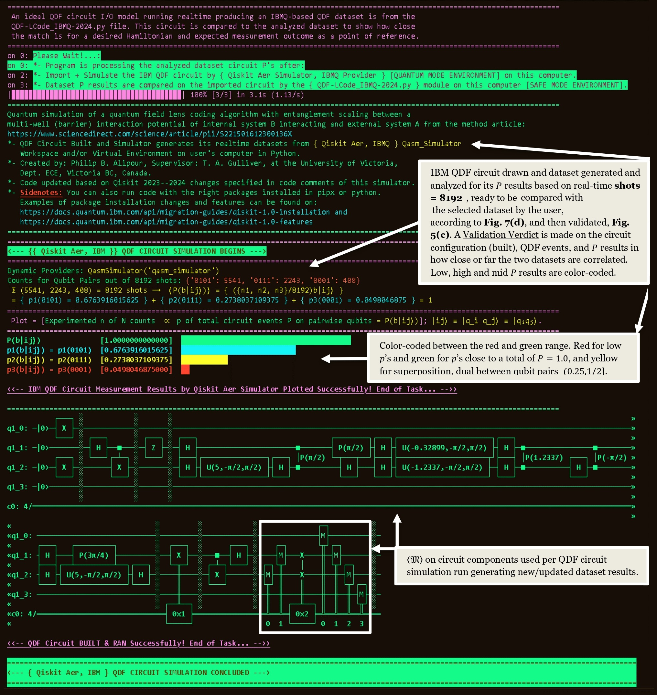

The QFLCS (Quantum Field Lens Coding Simulator) program analyzes the measurement outcome probability (P) data from datasets generated by Quantum Double-field (QDF) Circuits. The datasets are compared between ES and GS states as a P indicator generated for measurement samples. Small dataset samples denote: 

a. A particle pair’s energy state in a QDF (different GS states or sublevels of a GS, or see Sec. 3 of the published article),
b. a particle state in an SF, an ES relative to a GS from (a.) prior to a field transformation, and, 
c. the expected transformation of fields (ES ←→GS) and ⟨M(P, ψ_ij)⟩, as in Sec. 3 of the published article.

The file structure here is a sample mirror of the Mendeley repository file structure of v3+ at https://data.mendeley.com/datasets/gf2s8jkdjf/3, but with a much smaller file size for efficient download and use of the QFLCA project's code without the documentation (website) and demo vedo files. Certain small updates have been made in the main python file uploaded on Code Ocean for minor debugging purposes at https://doi.org/10.24433/CO.9905505.v1. 

* QFLCA project's code without the documentation (website) and demo vedo files can be found under the </code/root/lab/sim/QFLCC classifiers> directory in </code/root/lab/sim/QFLCC classifiers/docs> and </code/root/lab/sim/QFLCC classifiers/site> folders at https://doi.org/10.24433/CO.9905505.v1. 

* The main file is </code/root/lab/sim/QFLCC classifiers/QAI-LCode_QFLCC.py> which imports and executes the </code/root/lab/sim/QFLCC classifiers/QDF-LCode_IBMQ-2024-codable.py> or QDF-LCode_IBMQ-2024.py code for the simulation under Win OS or Linux OS. 

* We recommend downloading the entire <root> directory according to the folder structure and run QAI-LCode_QFLCC.py   in VSC with python latest packages installed for windows OS (the QDF game is developed for Windows OS, yet parts of the code for sound and display can be rewritten for Linux OS), e.g. "winsound" package as a compatible option. 
Other packages are needed to be installed or code rewritten for "sound" and "display" compatibility under other operating systems. 

 
* The QAI-LCode_QFLCC.py file has a Pygame GUI and other packages suited for local machine runs, rather than running this file on the Code Ocean platform which could take hours to compile and run a compatible program/game with packages. 
However, the  QDF-LCode_IBMQ-2024-codable.py can be run here as the core of the simulation program simulating the QDF circuit. 
A short presentation explaining these points are given in the </site/assets/video> directory as the "QAI-COcean-Demo.mp4" file.

* The User and Developer’s documentation/manual/demo is found under the </code/root/lab/sim/QFLCC classifiers> directory, as <site-prints> and <site> contents.

* In each folder, <IBMQ>, <QAI>, <QFLCC classifiers> and <QI> under </code/root/lab/sim>, Tips.txt and/or ReadMe.txt files exist to explain the contents of that directory. Also, under </code/root/lab> directory, a ReadMe file exists explaining the manual computation and presentation parts of the project.
